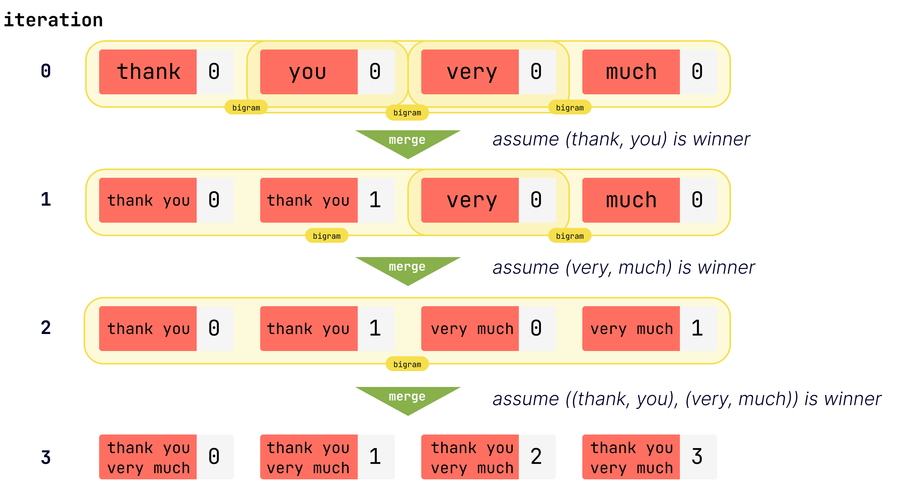

# REMERGE - Multi-Word Expression discovery algorithm

REMERGE is a Multi-Word Expression (MWE) discovery algorithm, which started as a re-implementation and simplification of a similar algorithm called MERGE, detailed in a publication and PhD thesis[^2][^3]. The primary benefit of this algorithm is that it's non-parametric in regards to the size of the n-grams that constitute a MWE—you do not need to specify a priori how many n-grams comprise a MWE—you only need to specify the number of iterations you want the algorithm to run.

The code was originally derived from an existing implementation from the original author[^1] that I reviewed, converted from python 2 to 3, then modified and updated with the following:
- a correction of the log-likelihood calculation; previously it was not using the correct values for the contingency table
- the removal of gapsize / discontinuous bigrams (see below for issues with the prior implementation)
- an overall reduction in codebase size and complexity
  - ~60% reduction in loc
  - removed `pandas` and `nltk` dependencies
- type annotations
- the inclusion of additional metrics (Frequency, [NPMI](https://svn.spraakdata.gu.se/repos/gerlof/pub/www/Docs/npmi-pfd.pdf)[^4]) for selecting the winning bigram.
- corrections for merging sequential bigrams greedily and completely.
  - e.g. `'ya ya ya ya'` -> `'(ya ya) (ya ya)'` -> `'(ya ya ya ya)'`. Previously the merge order was non-deterministic, and you could end up with `'ya (ya ya) ya'`
- An overall simplification of the algorithm. 
  - As a tradeoff, this version may be less efficient. After a bigram is merged into a single lexeme in the original implementation, new bigrams and conflicting (old) bigrams were respectively added and subtracted from a mutable counter of bigrams. The counts of this object were difficult to track and validate, and resulted in errors in certain cases, so I removed this step. Instead, only the lexeme data is updated with the new merged lexemes. Then, we track which lines contain the merged lexeme and create an *update* counter that subtracts the old bigrams from the new bigrams and updates the bigram data using that counter.
- [Clarified license with the original author](https://github.com/awahl1/MERGE/commit/0a118df852a573fa6db4cc9aea00fd8c691b52fa) and licensed as MIT.

#### Usage

```python
import remerge

corpus = [
    ["a", "list", "of", "already", "tokenized", "texts"],
    ["where", "each", "item", "is", "a", "list", "of", "tokens"],
    ["isn't", "a", "list", "nice"]
]

winners = remerge.run(
    corpus, iterations=1, method=remerge.SelectionMethod.frequency, progress_bar="all"
)
# winners[0].merged_lexeme.word == ('a', 'list')
```

There are 3 bigram winner selection methods: [Log-Likelihood (G²)](https://aclanthology.org/J93-1003.pdf)[^5], [NPMI](https://svn.spraakdata.gu.se/repos/gerlof/pub/www/Docs/npmi-pfd.pdf)[^4], and raw frequency. They are available under the `SelectionMethod` enum. The default is log-likelihood, which was used in the original implementation.

If using `NPMI` (`SelectionMethod.npmi`), you likely want to provide a `min_count` parameter, "as infrequent word pairs tend to dominate the top of bigramme lists that are ranked after PMI". (p. 4[^4])

```python
winners = remerge.run(corpus, 100, method=remerge.SelectionMethod.npmi, min_count=25)
```

#### API - `remerge.run`

| Argument     | Type                           | Description                                                                                                                                                                                                                                                                                     |
| ------------ | ------------------------------ | ----------------------------------------------------------------------------------------------------------------------------------------------------------------------------------------------------------------------------------------------------------------------------------------------- |
| corpus       | `List[List[str]]`              | A corpus of already tokenized texts.                                                                                                                                                                                                                                                            |
| iterations   | `int`                          | The maximum number of iterations to run the algorithm. Papers typically use >500.                                                                                                                                                                                                               |
| method       | `SelectionMethod`, optional    | One of "frequency", "log_likelihood", or "npmi". Defaults to "log_likelihood".                                                                                                                                                                                                                  |
| min_count    | `int`, optional                | The minimum count required for a bigram to be included in winner calculations for all methods. If choosing NPMI ("npmi"), prefer using min_count because this measure is biased towards infrequent word pairs. Defaults to 0.                                                               |
| output       | `Optional[Path]`, optional     | A file path to output the winning merged lexemes as JSON. Defaults to None.                                                                                                                                                                                                                     |
| progress_bar | `ProgressBarOptions`, optional | Verbosity of progress bar. "all" will display the lexeme and bigram construction progress each iteration plus total iteration progress. "iterations" will display progress on total iterations. "none" has no output. Defaults to "iterations".                                             |
| tie_breaker  | `TieBreaker`, optional         | How ties are resolved among equal-scoring candidates. "deterministic" ranks by score, then frequency, then lexicographic merged token order. "legacy_first_seen" uses prior first-seen behavior. Defaults to "deterministic".                                                             |
| on_exhausted | `ExhaustionPolicy`, optional   | Behavior when no candidate passes filters (or threshold): "stop" returns winners collected so far, "raise" raises `NoCandidateBigramError`. Defaults to "stop".                                                                                                                              |
| min_score    | `Optional[float]`, optional    | Optional minimum score threshold for the selected winner. If the best candidate is below this threshold, behavior follows `on_exhausted`. Defaults to None.                                                                                                                                   |

#### Install

Latest release:

```bash
pip install -U remerge-mwe
```

For latest from github:

```bash
pip install git+https://github.com/pmbaumgartner/remerge-mwe.git 
```

#### Development

Use [`uv`](https://github.com/astral-sh/uv) for local project and dependency management.
This package now builds a Rust extension via PyO3 + maturin, so a local Rust toolchain is required.

Create/sync the environment with all dependency groups:

```bash
uv sync --all-groups
```

Build/install the extension for the current environment:

```bash
uv run --no-sync maturin develop
```

Run tests:

```bash
uv run --no-sync pytest -v
```

Add a runtime dependency:

```bash
uv add <pkg>
```

Add a development dependency:

```bash
uv add --dev <pkg>
```

If you make changes under `rust/`, run `uv run --no-sync maturin develop` again before testing.

PyO3 troubleshooting:

```bash
# Print PyO3 interpreter/build config and stop.
PYO3_PRINT_CONFIG=1 uv run --no-sync maturin develop

# Force the Python interpreter PyO3 should inspect.
PYO3_PYTHON=.venv/bin/python uv run --no-sync maturin develop
```

If `cargo test` fails with unresolved Python symbols, confirm `pyo3/extension-module`
is not forced in `Cargo.toml`, then run:

```bash
cargo clean
cargo test
```

#### Rust/PyO3 Backlog

Planned follow-up after stabilization: split into a pure Rust core crate plus a thin
PyO3 bindings crate.

Trigger for this split:
1. Parity tests remain stable across 2 consecutive PRs.
2. CI remains green across 2 consecutive PRs.
3. Benchmark baseline from `bin/benchmark-remerge.sh --build release --runs 1 --iterations 5` is stable across 2 consecutive PRs.

#### How it works

The algorithm operates iteratively in two stages: first, it collects all bigrams of co-occurring `lexemes` in the corpus. A measure is calculated on the set of all bigrams to determine a winner. The two lexemes that comprise the winning bigram are merged into a single lexeme. Instances of that bigram (`lexeme` pair) in the corpus are replaced with the merged lexeme. Outdated bigrams, i.e. those that don't exist anymore because one of their elements is now a merged lexeme, are subtracted from the bigram data. New bigrams, i.e. those where one element is now a merged lexeme, are added to the bigram data. With this new set of bigram data, the process repeats and a new winner is selected.

At initialization, a `lexeme` consists of only a single token, but as the algorithm iterates lexemes become multi-word expressions formed from the winning bigrams. `Lexemes` contain two parts: a `word` which is a tuple of strings, and an `index` which represents the position of that specific token in a MWE. For example, if the winning bigram is `(you, know)`, occurrences of that sequence of lexemes will be replaced with `[(you, know), 0]` and `[(you, know), 1]` in the corpus. When bigrams are counted, only a root lexeme (where the index is 0) can form a bigram, so merged tokens don't get double counted. For a more visual explanation of a few iterations assuming specific winners, see the image below.



#### Limitations

This implementation is still a greedy agglomerative procedure, so local winner choices can influence later merges. Different selection methods (`frequency`, `log_likelihood`, `npmi`) can lead to materially different MWE inventories depending on corpus size and domain.

#### Issues with Original Algorithm

##### Single Bigrams with discontinuities forming from distinct Lexeme positions

One issue with discontinuities or gaps in the original algorithm is that it did not distinguish the position of a satellite lexeme occurring to the left or right of a bigram with a gap.

Take for example these two example sentences, using `-` to represent an arbitrary token:

```
a b c -
a - c b
```

Assume in a prior iteration, a winning bigram was `(a, _, c)`, representing the token `a`, a gap of `1`, and then the token `c`. with a gapsize of 1. The past algorithm, run on the above corpus, would count the token `b` twice towards the same n-gram `(a, b, c)`, despite there being two distinct n-grams represented here: `(a, b, c)` and `(a, _, c, b)`.

I think the algorithm is counting on the fact that it would be very rare to encounter this sequence of lexemes in a realistic corpus, where the same word would appear within the gap **and** after the gap. I think this is more of an artifact of this specific example with an unrealistically small vocabulary.

#### References

[^1]: awahl1, MERGE. 2017. Accessed: Jul. 11, 2022. [Online]. Available: https://github.com/awahl1/MERGE

[^2]: A. Wahl and S. Th. Gries, “Multi-word Expressions: A Novel Computational Approach to Their Bottom-Up Statistical Extraction,” in Lexical Collocation Analysis, P. Cantos-Gómez and M. Almela-Sánchez, Eds. Cham: Springer International Publishing, 2018, pp. 85–109. doi: 10.1007/978-3-319-92582-0_5.

[^3]: A. Wahl, “The Distributional Learning of Multi-Word Expressions: A Computational Approach,” p. 190.

[^4]: G. Bouma, “Normalized (Pointwise) Mutual Information in Collocation Extraction,” p. 11.

[^5]: T. Dunning, “Accurate Methods for the Statistics of Surprise and Coincidence,” Computational Linguistics, vol. 19, no. 1, p. 14.
