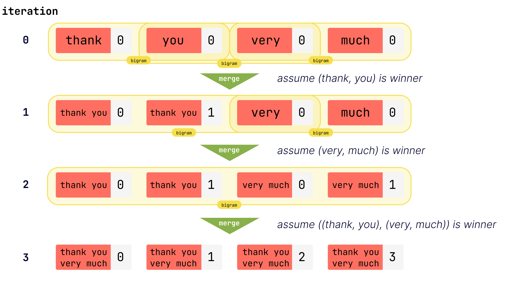

# REMERGE - Multi-Word Expression discovery algorithm

REMERGE is a greedy, bottom-up Multi-Word Expression (MWE) discovery algorithm derived from MERGE[^1][^2][^3].

Current implementation:
- Rust core engine (PyO3 extension) for fast iteration on large corpora
- Python API (`remerge.run`, `remerge.annotate`) with typed ergonomic results
- Deterministic tie-breaking and configurable scoring methods

The algorithm is non-parametric with respect to final MWE length: you set `iterations`, and merged expressions can grow as long as the corpus supports.

## Install

Latest release:

```bash
pip install -U remerge-mwe
```

Latest from GitHub:

```bash
pip install git+https://github.com/pmbaumgartner/remerge-mwe.git
```

## Quickstart

```python
import remerge

corpus = [
    "a list of already tokenized texts",
    "where each item is a document string",
    "isn't this API nice",
]

winners = remerge.run(corpus, iterations=1, method="frequency")

winner = winners[0]
print(winner)                    # merged phrase text (via WinnerInfo.__str__)
print(winner.merged_lexeme.word) # ('a', 'list')
print(winner.score)              # score used for winner selection
```

## Selection methods

Available winner-selection methods:
- `"log_likelihood"` (default; [Log-Likelihood / G²][^5])
- `"npmi"` ([Normalized PMI][^4])
- `"frequency"`

You can pass either enum values (`remerge.SelectionMethod.frequency`) or strings (`"frequency"`).

Tie-breaking is deterministic: score, then frequency, then lexicographic merged-token order.

## NPMI guidance

NPMI can saturate near `1.0` for rare but exclusive pairs, especially on large corpora. That can surface low-frequency artifacts unless `min_count` is set high enough.

Practical guidance:
- For discovery and ranking stability, prefer `log_likelihood` (the default).
- For NPMI, tune `min_count` aggressively and sweep upward until top results stabilize.
- On real corpora, values significantly above toy defaults are often needed.

```python
# Example starting point for larger corpora (tune further as needed)
winners = remerge.run(corpus, 100, method="npmi", min_count=200)
```

This aligns with the PMI caveat that infrequent pairs can dominate rankings[^4].

## Live progress output

For long runs, set `progress=True` to print live merge progress to `stderr`:

```python
winners = remerge.run(corpus, 500, progress=True)
```

## POS-constrained discovery from supplied tags

`run_tagged()` and `annotate_tagged()` accept explicit sentence-nested UPOS
annotations. This path does not load a tagger or retokenize text. Tags belong to
token occurrences, so equal surface forms may have different tags.

This release is deliberately **pretagged-only**: callers provide occurrence-
aligned English 17-tag UPOS. The package contains no built-in tagger, model
artifact, model loader, training runtime, neural runtime, automatic download,
or network request. The ordinary `run()` and `annotate()` APIs remain unchanged.

```python
import remerge

corpus = [
    remerge.TaggedDocument(
        sentences=((
            remerge.TaggedToken("record", "VERB"),
            remerge.TaggedToken("deal", "NOUN"),
        ),),
    )
]

winners = remerge.run_tagged(
    corpus,
    iterations=1,
    patterns=[("VERB", "NOUN")],
    method="frequency",
)
```

A pattern position is an exact UPOS tag, `"*"`, or a `frozenset` of exact
alternatives. Patterns contain at least two positions; a list of patterns is
OR-ed. Filtering is occurrence-constrained: only matching occurrences affect
candidate counts, scores, merges, results, and annotations. Proper subspans may
merge internally to discover longer patterns, but those support merges are not
returned and do not consume requested iterations.

Tagged discovery and `run_with_occurrences()` return `WinnerWithOccurrences`,
which adds exact original-token coordinates in `winner.occurrences`. Each
`MweOccurrence` records document, sentence, start-token, and exclusive
end-token indexes, so evaluation code need not infer spans from rendered
strings.

Use `remerge.from_conllu(text)` for strict CoNLL-U interchange. It retains
integer-ID word rows, skips multiword-token range and empty-node rows, preserves
punctuation and supplied sentence/document boundaries, and rejects malformed
or non-NFC input rather than repairing alignment.

Evaluation code can call `run_with_occurrences()` for the same unfiltered
discovery behavior as `run()` plus those structured coordinates. The ordinary
API continues to return the existing `WinnerInfo` shape.

Forms must be non-empty NFC strings without Unicode whitespace, and UPOS values
must be one of the 17 Universal POS tags. Supplied sentence boundaries are
authoritative. Tagged annotation output joins tokens with spaces and sentences
with newlines.

## API - `remerge.run`

| Argument | Type | Description |
| --- | --- | --- |
| `corpus` | `list[str]` | Corpus of document strings. Documents are split into segments by `splitter`, then tokenized with Rust whitespace splitting. |
| `iterations` | `int` | Maximum number of iterations. |
| `method` | `SelectionMethod | str`, optional | One of `"frequency"`, `"log_likelihood"`, `"npmi"`. Default: `"log_likelihood"`. |
| `min_count` | `int`, optional | Minimum bigram frequency required to be considered for winner selection. Default: `0`. |
| `splitter` | `Splitter | str`, optional | Segmenter before tokenization: `"delimiter"` (default) or `"sentencex"`. |
| `line_delimiter` | `str | None`, optional | Delimiter for `splitter="delimiter"`. Default: `"\n"`. Use `None` to treat each document as one segment. Ignored for `sentencex`. |
| `sentencex_language` | `str`, optional | Language code for `splitter="sentencex"`. Default: `"en"`. |
| `rescore_interval` | `int`, optional | Full-rescore interval for LL/NPMI. `1` means full rescore every iteration; larger values trade exactness for speed. Default: `25`. |
| `on_exhausted` | `ExhaustionPolicy | str`, optional | Behavior when no candidate is available (or score threshold not met): `"stop"` or `"raise"`. Default: `"stop"`. |
| `min_score` | `float | None`, optional | Optional minimum score threshold for selected winners. Default: `None`. |
| `progress` | `bool`, optional | If `True`, prints live merge progress to `stderr`. Default: `False`. |

`run()` returns `list[WinnerInfo]`.

Each `WinnerInfo` contains:
- `bigram`
- `merged_lexeme`
- `score`
- `merge_token_count`

Convenience helpers:
- `str(winner)` and `winner.text` for merged phrase text
- `winner.token_count` (alias of `winner.n_lexemes`) for merged token count
- `str(winner.merged_lexeme)` / `winner.merged_lexeme.text` for lexeme text
- `winner.merged_lexeme.token_count` for lexeme token count

## API - `remerge.annotate`

`annotate()` runs the same merge process as `run()`, then returns:

```python
(winners, annotated_docs, labels)
```

Where:
- `winners`: `list[WinnerInfo]`
- `annotated_docs`: `list[str]` of annotated output documents
- `labels`: sorted unique list of annotation labels generated

Arguments shared with `run()`:
- `corpus`, `iterations`, `method`, `min_count`, `splitter`, `line_delimiter`
- `sentencex_language`, `rescore_interval`, `on_exhausted`, `min_score`, `progress`

`annotate()`-specific arguments:
- `mwe_prefix: str = "<mwe:"`
- `mwe_suffix: str = ">"`
- `token_separator: str = "_"`

## Tokenization and output normalization

Tokenization uses Rust `split_whitespace()`.

Implications:
- Original whitespace formatting is not preserved.
- Annotated output reconstructs segments using normalized single-space joins.

## Performance and scaling notes

- Internal location tracking is intentionally memory-intensive.
- For large corpora, tune `min_count` and keep `iterations` practical.
- `rescore_interval=1` gives exact LL/NPMI rescoring each iteration; larger values trade exactness for speed.

## Development

This project uses `uv`, `ruff`, and `ty`.

```bash
# Sync environment
uv sync --all-groups

# Install the commit hook once per clone
uv run --no-sync prek install

# Build/install Rust extension into the active env
uv run --no-sync maturin develop

# Formatting, linting, typing, and Clippy checks
uv run --no-sync prek run --all-files

# Python tests
uv run --no-sync pytest -v -m "not performance"

# Opt-in reference-corpus performance guard
REMERGE_PERF_GUARD=1 uv run --no-sync pytest -q tests/performance/test_runtime.py
```

If you change files under `rust/`, rebuild the extension before running Python tests:

```bash
uv run --no-sync maturin develop
```

## Releasing (maintainers)

Releases are automated by `.github/workflows/release.yml`.

At a minimum:
1. Keep `pyproject.toml` and `Cargo.toml` versions aligned.
2. Push to `main`.
3. Tag with `vX.Y.Z` to trigger release publication.

Use `bin/pypi-smoke.py` to validate the newest published package from PyPI.

## How it works

Each iteration:
1. Score candidate bigrams.
2. Select the winner.
3. Merge winner occurrences into a new lexeme.
4. Update internal bigram/lexeme state.

Lexemes use `(word, ix)` semantics, where `ix=0` is the root position and only root lexemes participate in bigram formation.



## Limitations

- REMERGE is greedy/agglomerative: early winner choices can influence later merges.
- Different methods (`frequency`, `log_likelihood`, `npmi`) can produce materially different inventories depending on corpus/domain.

## Notes on the original MERGE gapsize behavior

This implementation intentionally excludes discontinuous/gapped bigram merging. The old gapsize path could conflate distinct positional configurations in edge cases, which made behavior harder to reason about and validate.

## References

[^1]: awahl1, MERGE. 2017. Accessed: Jul. 11, 2022. [Online]. Available: https://github.com/awahl1/MERGE

[^2]: A. Wahl and S. Th. Gries, “Multi-word Expressions: A Novel Computational Approach to Their Bottom-Up Statistical Extraction,” in Lexical Collocation Analysis, P. Cantos-Gómez and M. Almela-Sánchez, Eds. Cham: Springer International Publishing, 2018, pp. 85–109. doi: 10.1007/978-3-319-92582-0_5.

[^3]: A. Wahl, “The Distributional Learning of Multi-Word Expressions: A Computational Approach,” p. 190.

[^4]: G. Bouma, “Normalized (Pointwise) Mutual Information in Collocation Extraction,” p. 11.

[^5]: T. Dunning, “Accurate Methods for the Statistics of Surprise and Coincidence,” Computational Linguistics, vol. 19, no. 1, p. 14.
